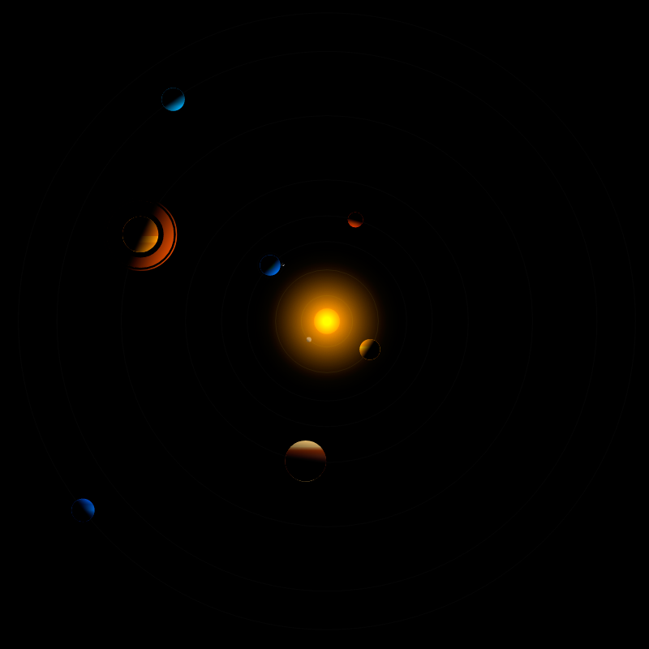

# SVG Solar System: Orbit of Planets
> A pure SVG Solar System with CSS animated Orbit of Planets



## Demo: Online Test
[https://treedbox.github.io/solar-system-orbit-planets/](https://treedbox.github.io/solar-system-orbit-planets/)

## How it works
HTML: Using **SVG** to draw groups of circles:
```
<g class="earth-group">
  <circle class="earth-limit" cx="50%" cy="50%" r="590"/>
  <circle class="moon-orbit" cx="50%" cy="50%" r="500"/>
  <g class="moon-group">
    <circle class="moon" cx="50%" cy="50%" r="50"/>
    <circle class="moon-shadow" cx="50%" cy="50%" r="50"/>
  </g>
  <circle class="earth" cx="50%" cy="50%" r="400"/>
  <circle class="shadow" cx="50%" cy="50%" r="400"/>
</g>
```
### Set SVG Radial and Linear Gradient

SVG: Radial Gradient with an **id**:
```
<radialGradient id="sun">
  <stop offset="30%" stop-color="yellow"/>
  <stop offset="100%" stop-color="orange"/>
</radialGradient>
```

SVG: Linear Gradient with an **id**:
```
<linearGradient id="saturn" x1="0" x2="0" y1="0" y2="100%">
  <stop offset="0%"   stop-color="#ec9a22"/>
  <stop offset="40%"  stop-color="#d16c10"/>
  <stop offset="55%"  stop-color="#d16c10"/>
  <stop offset="50%"  stop-color="#ec9925"/>
  <stop offset="70%"  stop-color="#ec9925"/>
  <stop offset="75%"  stop-color="#d07b15"/>
  <stop offset="100%" stop-color="#ec9a22"/>
</linearGradient>
```
CSS: Use **id** to apply Gradients with **fill**:
```
.sun {
  fill:url(#sun);
  transform: rotate(10deg);
  transform-origin: center;
}
```
CSS: Set **animation** to call @keyframes:
```
.earth-group{
  transform-origin: center;
  animation: earth-group 13s linear infinite;
}
```
CSS: Use transform **rotate** and **translate** to simulate orbits of the Planets positioning planet from the center (defined in **transform-origin**):
```
@keyframes earth-group {
	0%{
		transform: rotate(0deg) translate(3100px);
	}
	100%{
		transform: rotate(-360deg) translate(3100px);
	}
}
```
## Tested
**Google Chrome 59**

**Firefox 53.0.3, 54.0**

*Works with or wihout a server*

## Meta
Front-End Developer: [Jonimar Marques Policarpo](http://linkedin.com/treedbox 'LinkEdin')

Twitter: [@treedbox](http://twitter.com/treedbox)

E-mail: [treedbox@gmail.com](mailto:treedbox@gmail.com)

Site: [treedbox](http://treedbox.com)

## License
[MIT](LICENSE.md) © [TreedBox](https://github.com/treedbox)

[https://github.com/treedbox/solar-system-orbit-planets](https://github.com/treedbox/solar-system-orbit-planets)
